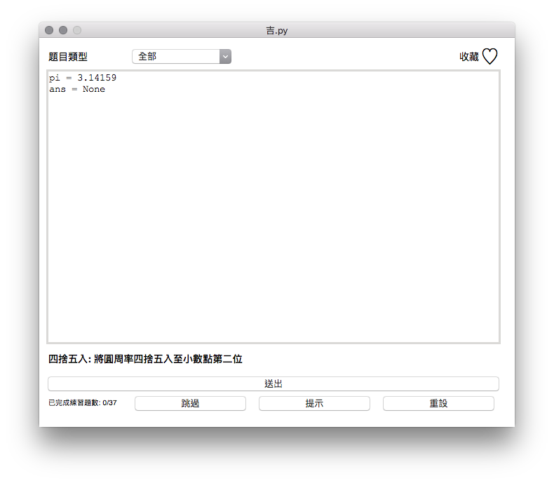

# ji.py

`/dʒi dɑt paɪ/`
吉打拍

---
[]()
[](https://travis-ci.org/amigcamel/ji.py)
[](https://coveralls.io/github/amigcamel/ji.py?branch=master)
[](https://opensource.org/licenses/MIT)

*吉打拍* 是一個幫助學習Python的小工具，  
題目按照Python的基本資料型態作為分類，  
使用者可以將不熟悉的題目收藏（點選右上角愛心圖示），  
讓日後複習更加方便。

如果妳/你覺得這個專案不錯，請在右上角幫我按顆星星，  
或是一起加入開發的行列，謝謝！

如果有任何建議或發現任何問題，歡迎在[issues](https://github.com/amigcamel/ji.py/issues)留下任何訊息。



## 版本

Python 3.6+ 

## 安裝 

    $ pip install -U ji.py
    $ jipy

或是 clone 這份專案後，執行

    $ python -c 'from jipy.main import run_app; run_app()'


## 反安裝

    $ pip uninstall ji.py

## Test

    tox

Coverage test

    coverage report -m

---

## Documentation

All the quizzes are in `YAML` format, and the following is the basic structure.

```yaml
ClassName:
  answer:  
  criteria:
    - self.local.get('ans') == self.answer
  description: 
  hint: 
  name: 
  presets:
    ans: null
  result_variable: ans 
  test_code: |
    ans = None
```

| Item             | Explaination     | Require  | Default                                  | type        |
| ---------------- | ---------------- | -------- |----------------------------------------- | ----------- |
| ClassName        | object class name| ✓        |                                          | string      | 
| answer           | quiz answer      | ✓        |                                          |             | 
| criteria         | judging criteria |          | `self.local.get('ans') == self.answer`   | list        | 
| description      | quiz description | ✓        |                                          | string      | 
| hint             | quiz hint        | ✓        |                                          | string      | 
| name             | quiz name        | ✓        |                                          | string      | 
| presets          | initial variables|          | `ans = None`                             | dict        | 
| result_variable  | judging variables|          | `ans`                                    | string      | 
| test_code        | initial variables| ✓        |                                          | string      | 
